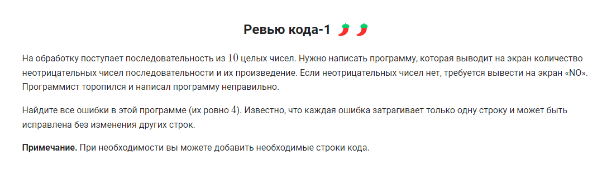

```python
n = int(input())
first = -1
second = -2

for i in range(n):
    x = int(input())
    if(x>first):
        second = first
        first = x
    elif(x>second):
        second = x
print(first, second, sep='\n')
```


```python
count = 1
for i in range(10):
    x = int(input())
    if(x%2!=0):
        count = count * 0
    else:
        count = count * 1
        
if(count==0):
    print('NO')
else:
    print('YES')
```


```python
n = int(input())
first = 1
second = 1
if(n==1):
    print(1)
for i in range(n-1):
    if(i==0):
        print(1, 1, end=' ')
    else:
        first, second = second, first + second
        print(second, end=' ')
```


```python
count = 0
s = str(input())
while (s != 'стоп' and s != 'хватит' and s != 'достаточно'):
    count += 1
    s = str(input())
print(count)

```


```python
num = int(input())

count = 0
result = 0

while num != 0:
    
    last_digit = num % 10
    num = num // 10
    count += 1
    result = result*10 + last_digit

   
print(result)

```


```python
num = int(input())

last_digit = num % 10
count = 0
countx = 1
sum = 0

while num != 0:
    
    first_digit = num % 10
    num = num // 10
    count += 1
    countx = first_digit*countx
    sum = sum + first_digit
  
print(sum, count, countx, sum/count, first_digit, first_digit+last_digit, sep='\n')

```


```python
num = int(input())
count = 1
uni_digit = num % 10

while num != 0:

    first_digit = num % 10
    num = num // 10
    if (first_digit >= uni_digit):
        count *= 1
    else:
        count *= 0
    uni_digit = first_digit
    
if count == 1:
    print('YES')
else:
    print('NO')

```


```python
num = int(input())

for i in range(1, num+1):
    if i >= 5 and i <= 9:
        continue
    elif i >= 17 and i <= 37:
        continue
    elif i >= 78 and i <= 87:
        continue
    print(i)

```



```python
p = 1 #первая ошибка
for i in range(1, 11):  #10 поправил на 11
    x = int(input())
    if x >= 0: #вместо > поставил >=
        p = p * x
        count = count + 1
if count > 0:
    print(count)  #поменял на count
    print(p)
else:
    print('NO')
```


```python
mx = -100000 #поправил, было 0
s = 0
for i in range(1, 11): #поправил, было range(11)
    x = int(input())
    if x < 0:
        s = s + x  # поправил, было s = x
        if (x >= mx): #поправил, было >
            mx = x
if (s == 0): #дописал условие что нет отрицательных чисел
    print('NO')
else:
    print(s)
    print(mx)
```


```python
n = int(input())
max_digit = -1 #поправил условие
while n != 0:  #поправил условие
    digit = n % 10
    if digit % 3 == 0 and digit > max_digit: #поправил условие
            max_digit = digit #перевернул условие
    n = n // 10 #поправил деление
if max_digit == -1: #поправил условие
    print('NO')
else:
    print(max_digit)
```


```python
n = int(input())
while n > 9:  #
    n //= 10 #
print(n)

```


```python
n = int(input())
for i in range(n):
    print('')
    for j in range(3):
        print(n, end=' ')
```


```python
n = int(input())
for i in range(n):
    print('')
    for j in range(5):
        print(i+1, end=' ')
```


```python

n = int(input())
for i in range(n):
    print('')
    for j in range(9):
        print(i+1, '+', j+1, '=', i+j+2, end='\n')
```


```python
n = int(input())
k = n // 2 + 1
m = n // 2
for i in range(k):
    for j in range(i + 1):
        print('*', end='')
    print()
for i in range(m):
    for j in range(m - i):
        print('*', end='')
    print()
```


```python

n = int(input())
for i in range(n):
    for j in range(i + 1):
        print(i+1, end='')
    print()

```


```python
num = 1
n = int(input())
for i in range(1, n+1):
    for j in range(1, i+1):
        print(num, end=' ')
        num += 1
    print()

```


```python
n = int(input())
for i in range(1, n+1):
    for j in range(1, i+1):
        print(j, end='')
    for k in range(i-1, 0, -1):
        print(k, end='')
    print()
```


```python
n = int(input())


for i in range (1, n+1):
    print(i, end='')
    for j in range(1, i+1):
            if i % j == 0:
                print('+', end='')
    print()

```


```python
from math import factorial
n = int(input())
sum = 0
for i in range(1, n+1):
    sum += factorial(i)
print(sum)
```


```python

```


```python
a = int(input())
b = int(input())

def is_prime(n):
    # Функция проверяет, является ли число n простым
    if n < 2:
        return False
    for i in range(2, int(n**0.5) + 1):
        if n % i == 0:
            return False
    return True

for n in range(a, b + 1):
    # Перебираем все числа от a до b и выводим простые
    if is_prime(n):
        print(n)
```
